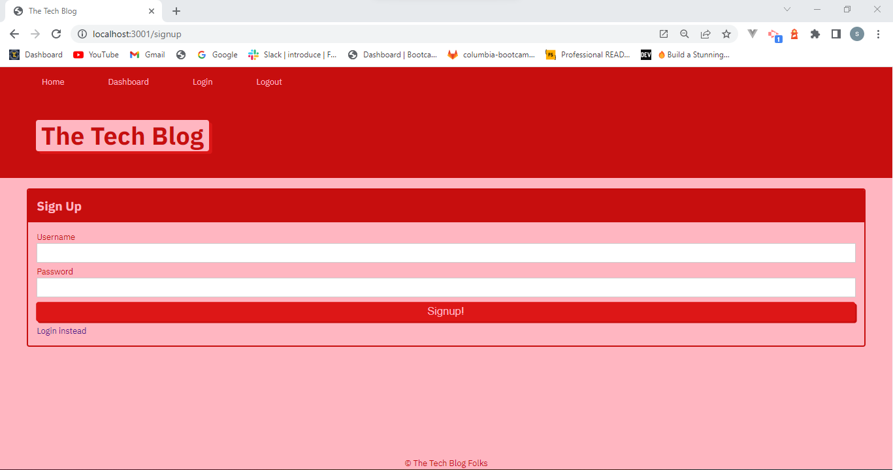

# SwTechBlog

  ## Description
    This is a basic tech blog that allows users to create and account, sign in, create post and comments. Happy blogging!

  ## Table of Contents
    * [Installation](#installation)
    * [Usage](#usage)
    * [License](#license)
    * [Contributing](#contributing)
    * [Tests](#tests)
    * [Questions](#questions)
  
  ## Installation 
    To install necessary dependencies, run the following command: 
    npm i

   
  ## Usage
    npm run start 

  ## License
    
    This project is licensed under the following license: MIT

  ## Contributing 
   To contributr I can be reached through GitHub

  ## Tests 
    To run tests, run the following command:
    N/A

  ## Questions 
    For any questions the owner of this repo can be contacted through thier GitHub:swagshall 

 ## images 
 
